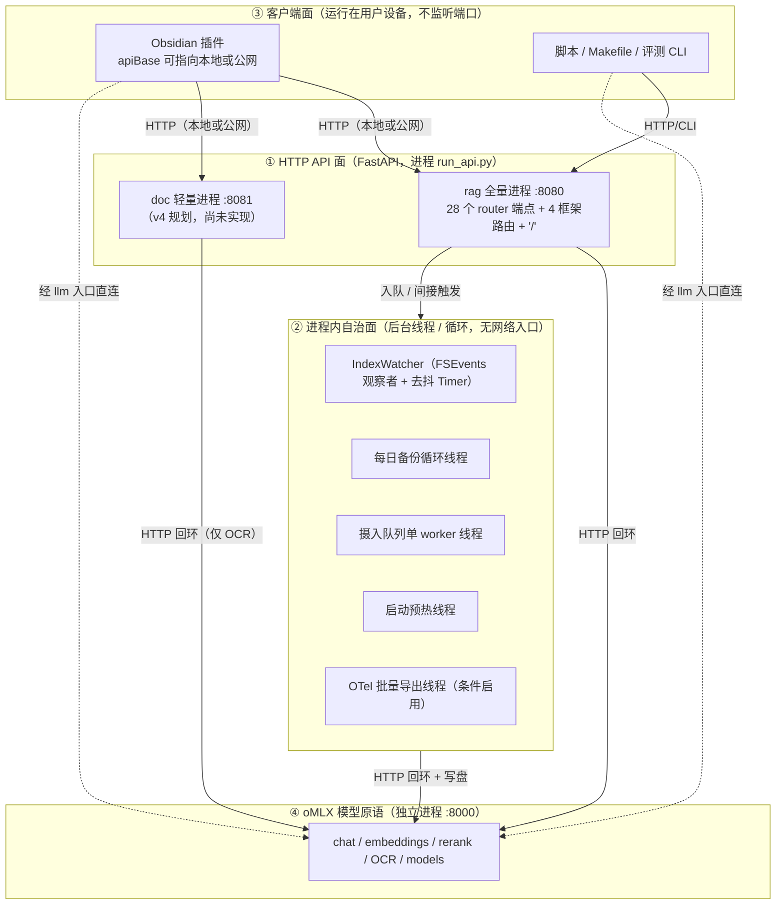

# 功能点清单与暴露面裁定（feature inventory & exposure plan）

> 版本：v2（**用户裁定回填稿**；v1 为评审稿）
> 生成日期：2026-09-15（裁定回填：2026-09-15）
> 适用项目：`/Users/xuhuaming/projects/rag-service`（Apple Silicon Mac 上的个人知识库 RAG 服务）
> 关联既有文档：`docs/public-deployment-plan.md`（**v5 部署方案，路径级白名单版**）、`docs/feature-map-and-status.md`（功能全景）
> 本文件在 v1「评审稿」基础上，把第 3 节的「建议归属」列**回填为用户 2026-09-15 的裁定**，并新增「用户白名单 → nginx 路径白名单」映射表（**第 5 节**）与「待确认」小节（**第 6 节末**）。

---

## 1. 本文件怎么用（裁定说明）

**这是一份「用户已裁定、按裁定回填」的清单**（v1 为评审稿，v2 为回填稿）。

- 第 3 节逐条列出**该项目的全部功能点**，每条给出「**用户裁定（2026-09-15）**」与「归属判据」两列。
- **「用户裁定」列已是最终归属**（不再是建议）：其取值只由用户 2026-09-15 的公网白名单与其后的口头裁定决定。
- 我方已**据此修订部署方案**（`docs/public-deployment-plan.md` 升级为 **v5**）——即：把用户划入「公网」的功能写进对外入口（nginx 路径级白名单）、把划入「仅局域网/仅 Mac 本地」的功能从对外入口关闭或保持环回。**映射表见第 5 节**。
- **本次仍不产生任何代码改动、配置改动或部署动作**（见第 7 节）——裁定只确定文档层面的归属，落地需按 v5 的改造清单（C-16 等）执行。

### 用户已裁定的决策问题（结论见第 6 节）

1. 是否允许公网调用问答（`/v1/query`、`/v1/query/stream`）？
2. `/v1/export`（整包导出，含配置与密钥）是否**绝对禁止**出网？
3. `/v1/config`、`/v1/import` 这类「改配置 / 改数据」端点是否**一律留本地**？
4. 会话内容（含个人笔记正文）是否允许经公网入口读/写？
5. 是否需要多用户 / 多把 key（当前是**单把 key、无权限分级**）？
6. 是否允许公网直连 oMLX 模型原语（`llm.linzhong.xyz`）？
7. 问答沉淀（向 vault 写 `.md`）是否允许由**公网**问答触发？
8. 深度研究 `/v1/research` 是否公网？
9. 框架自带的 `/docs`、`/redoc`、`/openapi.json`、`/docs/oauth2-redirect` 是否在公网入口关闭？
10. 全量/增量**索引**类端点是否一律留本地？

### 归属三档定义（第 3 节「用户裁定」列只用这三个取值；个别项标「待确认」见第 6 节末）

| 取值 | 含义 |
|---|---|
| **公网** | 允许经对外入口（`*.linzhong.xyz:1443`）被公网访问 |
| **仅局域网** | 只允许局域网（192.168.x 网段）访问，不进公网入口 |
| **仅 Mac 本地** | 只允许 Mac 环回（`127.0.0.1`）访问，且**不得**出现在任何对外/局域网入口 |

---

## 2. 能力面三层总览

本项目对外可被触达的能力分三层，另有一个**被依赖的模型层**（oMLX）。四者关系如下。

**「谁能触达谁」速查：**

| 层 | 谁能触达它 | 它能触达谁 |
|---|---|---|
| ① HTTP API 面 | 公网（经 1443 反代）、局域网、本机、③ 客户端面 | 写本地磁盘、调 ④ 模型原语、触发 ② 自治面（入队）、唯一出网点：`/v1/index/url` 抓外部网页 |
| ② 进程内自治面 | **无网络入口**；仅被 ① 间接触发（如 `/v1/index/async` 入队）或随进程启动 | 写本地磁盘、调 ④ 模型原语 |
| ③ 客户端面 | 用户在本机操作（不监听任何端口） | **只能调 ①**（按 `apiBase` 决定打本地还是公网）；其归属不适用三档入口矩阵 |
| ④ oMLX 模型原语 | llm 入口（公网/局域网）、① 内部回环调用、③ 经 llm 入口直连 | 只消耗本地 GPU，不写 rag-service 数据 |

> **重要事实（核验结论）**：v4 部署方案里「① 绑 `0.0.0.0:8080`」「② 绑 `0.0.0.0:8081`（`RAG_MODE=convert`）」是**规划中的改造**——当前代码 `run_api.py:268-269` 只绑 `127.0.0.1:8080`，且**不存在** `RAG_MODE` 分支、也不存在 `8081`。也就是说：**「三个入口」目前尚未在代码里落地**，第 5 节的矩阵是对「**v5 路径白名单实施后**」的**裁定归属**。

> ### ⚠️ 本文件全部结论的适用前提（务必先读）
>
> **当前服务只绑定 `127.0.0.1:8080`（`run_api.py:268-269`），尚未对外监听。**
> 因此第 3 节所有「副作用 / 可通过网络触发」的判断，**目前只对本机（Mac 环回）成立**；只有**改绑 `0.0.0.0` 或加反代/隧道之后**，才会对局域网、公网成立。
> 用户评审时是**基于「未来暴露后」**做归属决定——**这些风险目前尚未发生**，本清单是「暴露前先想清楚」的依据，不是「已经暴露」的事故报告。

---

## 3. 逐条功能点清单（核心，穷尽表）

> 字段固定 10 列：`编号 | 功能名 | 能力域 | 实现位置(文件:行) | 触发方式/端点 | 依赖 | 副作用 | 默认开关 | 用户裁定（2026-09-15） | 归属判据`
> `实现位置` 均为已核验的真实行号（`grep`/`Read` 二次核对）；`用户裁定` 为**用户 2026-09-15 的最终归属**（三档：公网 / 仅局域网 / 仅 Mac 本地；个别项标注「待确认」，含义见第 6 节末）。

### 3.1 HTTP API 面 —— 26→**28** 个 router 端点（编号 E01–E28）

> **计数更正**：委派说明按「26 个端点」传递，实测为 **28 个**。差额来自 `src/api/routes/sessions.py` 的两个基础端点 `GET /v1/sessions`（`sessions.py:61`）与 `POST /v1/sessions`（`sessions.py:67`）在传递时被漏计。下表按 **28** 个逐个列出（自查见第 8 节附录）。实际前缀以 `src/api/app.py:198-205` 的 `include_router` 为准：`query/index/status/research/config/archive/convert` 前缀 `/v1`，`sessions` 前缀 `/v1/sessions`。

| 编号 | 功能名 | 能力域 | 实现位置(文件:行) | 触发方式/端点 | 依赖 | 副作用 | 默认开关 | 用户裁定（2026-09-15） | 归属判据 |
|---|---|---|---|---|---|---|---|---|---|
| E01 | 整包导出归档 | 归档 | `src/api/routes/archive.py:78` | `GET /v1/export` | 向量库+文件系统+配置 | 读全库、写 `data/exports/*.zip`、**删旧导出**、**打包 `settings.yaml`（含 `omlx.api_key`/`auth.api_key`）**、泄露文档绝对路径 | 端点常开（`archiveTools` 仅控插件入口） | 仅 Mac 本地 | 一票否决：导出全库 + 含密钥 + 删数据 |
| E02 | 整包导入归档 | 归档 | `src/api/routes/archive.py:109` | `POST /v1/import?mode=merge\|replace` | 向量库+文件系统 | `replace` 先 `shutil.rmtree` 清空向量库、合并复制会话/附件、**写盘** | 端点常开 | 仅 Mac 本地 | 一票否决：可删数据 + 可改数据 |
| E03 | 读取可调配置 | 配置 | `src/api/routes/config.py:137`（`_public_config` 于 `config.py:49-63`） | `GET /v1/config` | 纯内存（配置） | 只读；**泄露内部结构**（`omlx.base_url`、模型名、检索/生成参数）；**且会把 `ocr` 子对象整段返回（`config.py:61`），包含 `ocr.api_key`（`src/config.py:103`、`settings.yaml:64`）——一旦该字段被填真 key，此端点即回吐密钥** | 端点常开 | 仅 Mac 本地 | 读操作，但泄露内部结构；`omlx` 做了字段白名单（不含 `api_key`）而 `ocr` 未做 → **不对称，是真实缺口**（见第 8 节风险 12、第 9 节）。**用户裁定：`/v1/config`（含读）一律仅 Mac 本地。** |
| E04 | 修改配置（热生效） | 配置 | `src/api/routes/config.py:146` | `POST /v1/config` | 配置+文件系统 | **写回 `config/settings.yaml`** + 热应用运行组件；白名单外字段拒绝 | 端点常开 | 仅 Mac 本地 | 一票否决：可改配置（用户裁定 Q3：一律留本地） |
| E05 | 任意文档→Markdown | 转换 | `src/api/routes/convert.py:124` | `POST /v1/convert/to-md` | 本地解析库 + 可选 OCR(GPU) | 纯 CPU 解析（可选 OCR 耗 GPU）；**口径不落盘** | 端点常开 | 公网 | 用户白名单第 4 项；只读输入→返回文本，不写盘、不碰库、不改配置 |
| E06 | HTML→Markdown（兼容） | 转换 | `src/api/routes/convert.py:178` | `POST /v1/convert/html2md` | 本地解析库 | 同 E05（仅 HTML） | 端点常开 | 公网 | 同 E05（用户白名单第 4 项） |
| E07 | 列出支持的格式 | 转换 | `src/api/routes/convert.py:212` | `GET /v1/convert/formats` | 纯内存 | 只读静态列表 | 端点常开 | 公网（待确认） | 无副作用；用户白名单含「文档提取 md」，`formats` 是否放行见第 6 节末「待确认」 |
| E08 | 全量索引 | 索引 | `src/api/routes/index.py:34` | `POST /v1/index`（可带 `rebuild=true`） | 向量库+模型(GPU)+文件系统 | **写向量库**、耗 GPU（嵌入）；`rebuild=true` **清空重建** | 端点常开 | 仅 Mac 本地 | 一票否决：写库 + 耗算力 + `rebuild` 可清库（用户裁定 Q10） |
| E09 | 索引远程网页 | 索引 | `src/api/routes/index.py:68` | `POST /v1/index/url` | 外网+向量库+模型 | **服务端主动对外发起网络请求**（SSRF 已防护）、写向量库、耗 GPU | 端点常开 | 仅 Mac 本地 | 一票否决：服务端出网点 + 写库（用户裁定 Q10） |
| E10 | 提交后台摄入任务 | 索引 | `src/api/routes/index.py:138` | `POST /v1/index/async`（`full\|incremental\|url`） | 队列+向量库+模型 | 入队（写 `data/index_jobs.json`）；`url` 类型含 E09 出网；执行时写向量库 | 端点常开 | 仅 Mac 本地 | 可触发写库/出网；数据写入型（用户裁定 Q10） |
| E11 | 列出摄入任务 | 索引 | `src/api/routes/index.py:163` | `GET /v1/index/jobs` | 纯内存/磁盘 | 只读；返回任务参数（含 `url`）与结果 | 端点常开 | 仅 Mac 本地 | 读操作，但暴露任务参数/内部信息；**用户裁定：`/v1/index*` 一律仅 Mac 本地** |
| E12 | 查询单个任务 | 索引 | `src/api/routes/index.py:174` | `GET /v1/index/jobs/{job_id}` | 纯内存/磁盘 | 只读单任务详情 | 端点常开 | 仅 Mac 本地 | 同 E11（`/v1/index*` → 仅 Mac 本地） |
| E13 | 取消摄入任务 | 索引 | `src/api/routes/index.py:184` | `POST /v1/index/jobs/{job_id}/cancel` | 队列 | 修改任务状态（控制操作） | 端点常开 | 仅 Mac 本地 | 控制类写操作（`/v1/index*` → 仅 Mac 本地） |
| E14 | 增量索引 | 索引 | `src/api/routes/index.py:194` | `POST /v1/index/refresh` | 向量库+模型+文件系统 | **写向量库**（新增/更新/删除）、耗 GPU | 端点常开 | 仅 Mac 本地 | 一票否决：写库 + 耗算力（用户裁定 Q10） |
| E15 | 同步问答 | 查询 | `src/api/routes/query.py:30` | `POST /v1/query` | 向量库+模型(GPU)+文件系统 | 耗 GPU（嵌入/重排/生成）；**返回知识库原文与来源 `file_path`（绝对路径）**；若 `syntheses.enabled` 则**写 vault 的 `.md`（见 B′01）** | 端点常开 | 公网 | 核心用途（从外部提问自己的库）。**用户裁定（Q1）：允许公网问答**——配套 C-03（鉴权）+ C-07（限流）+ **C-16（响应脱敏，收窄 `file_path`/`content`）**；B′01 沉淀按 Q7 **保持开启** |
| E16 | 流式问答（SSE） | 查询 | `src/api/routes/query.py:80` | `POST /v1/query/stream` | 同 E15 | 同 E15（流式） | 端点常开 | 公网 | 同 E15。**用户裁定（Q1）：公网** |
| E17 | 深度研究 | 查询 | `src/api/routes/research.py:25` | `POST /v1/research` | 向量库+模型(GPU)+文件系统 | **多次 LLM 调用（算力重）**、返回报告与来源（含 `file_path`） | 端点常开（插件入口默认关） | 公网 | **用户裁定（Q8）：深度研究对外（公网）**。算力最重、耗时最长，故 v5 在 `rag` 入口对它用**更紧的 burst/并发**（§1B.2）。 |
| E18 | 列出会话 | 会话 | `src/api/routes/sessions.py:61` | `GET /v1/sessions` | 文件系统 | 只读会话元信息（标题/时间） | 端点常开 | 仅 Mac 本地 | **用户裁定：会话内容不经公网读写 → 仅 Mac 本地**。会话标题可能含笔记语义 |
| E19 | 创建会话 | 会话 | `src/api/routes/sessions.py:67` | `POST /v1/sessions` | 文件系统 | 写 `data/conversations/*.json` | 端点常开 | 仅 Mac 本地 | **用户裁定：会话不经公网读写 → 仅 Mac 本地**（公网问答为无状态，不需建会话） |
| E20 | 清理旧会话 | 会话 | `src/api/routes/sessions.py:78` | `POST /v1/sessions/cleanup` | 文件系统 | **删除**除最新 N 条外的会话 | 端点常开 | 仅 Mac 本地 | 一票否决：删数据（用户裁定 Q4：会话不公网） |
| E21 | 导出全部会话 | 会话 | `src/api/routes/sessions.py:91` | `GET /v1/sessions/export` | 文件系统 | 只读；**导出全部会话含个人笔记原文** | 端点常开 | 仅 Mac 本地 | 一票否决：全量敏感数据导出（用户裁定 Q4：会话不公网） |
| E22 | 读取会话内容 | 会话 | `src/api/routes/sessions.py:97` | `GET /v1/sessions/{session_id}` | 文件系统 | 只读；**返回会话全部消息（含个人笔记内容）** | 端点常开 | 仅 Mac 本地 | **含个人笔记，敏感**；**用户裁定（Q4）：会话内容不公网 → 仅 Mac 本地** |
| E23 | 追加会话消息 | 会话 | `src/api/routes/sessions.py:106` | `POST /v1/sessions/{id}/messages` | 文件系统 | **写会话文件**（role 白名单校验） | 端点常开 | 仅 Mac 本地 | 写操作；**用户裁定（Q4）：会话不经公网读写 → 仅 Mac 本地** |
| E24 | 截断会话 | 会话 | `src/api/routes/sessions.py:115` | `POST /v1/sessions/{id}/truncate` | 文件系统 | **删除**该会话 `keep_count` 之后的消息 | 端点常开 | 仅 Mac 本地 | 一票否决：删数据（用户裁定 Q4：会话不公网） |
| E25 | 重命名会话 | 会话 | `src/api/routes/sessions.py:124` | `POST /v1/sessions/{id}/rename` | 文件系统 | 写会话标题（低危） | 端点常开 | 仅 Mac 本地 | 低危写；**用户裁定（会话不公网）→ 仅 Mac 本地** |
| E26 | 删除会话 | 会话 | `src/api/routes/sessions.py:133` | `DELETE /v1/sessions/{id}` | 文件系统 | **删除**该会话文件 | 端点常开 | 仅 Mac 本地 | 一票否决：删数据 |
| E27 | 系统状态 | 状态 | `src/api/routes/status.py:23` | `GET /v1/status` | 向量库+内存 | 只读；**返回 metrics（含最近请求的 path/方法/耗时）**、集合名、向量数、当前任务 | 端点常开 | 仅局域网 | 读操作；metrics 暴露内部请求路径与结构 |
| E28 | 健康检查 | 状态 | `src/api/routes/status.py:68` | `GET /v1/health` | 纯内存 | 只读（`healthy`/`uninitialized`） | 端点常开 | 仅局域网 | 无副作用，供探针使用；**用户白名单未纳入**（公网是否放行见第 6 节末「待确认」）。 |

### 3.2 HTTP API 面 —— 框架自带 / 应用级路由（编号 E29–E33）

> **关键安全事实**：FastAPI 自带的 `/docs`、`/docs/oauth2-redirect`、`/redoc`、`/openapi.json` **直接挂在 app 上、不经 `include_router`**（`src/api/app.py:198-205` 的 `auth_deps` 只加在 router 上），因此**不受 `verify_bearer` 保护**——即使 `auth.enabled=true`，这四个路由仍**无需 key 即可访问**。必须以其他方式（如 `docs_url=None`/`redoc_url=None`/`openapi_url=None`、网络层拦截）在公网入口关闭。
> 已用 `create_app().routes` 实测（FastAPI 0.141.1）：app 级默认挂载 **4 条**——`/openapi.json`、`/docs`、`/docs/oauth2-redirect`、`/redoc`。

| 编号 | 功能名 | 能力域 | 实现位置(文件:行) | 触发方式/端点 | 依赖 | 副作用 | 默认开关 | 用户裁定（2026-09-15） | 归属判据 |
|---|---|---|---|---|---|---|---|---|---|
| E29 | Swagger UI | 框架路由 | `src/api/app.py:147`（`FastAPI(...)` 自动挂载，无显式装饰器） | `GET /docs` | 纯内存 | 只读；**暴露完整 API schema，且不受 Bearer 保护** | 默认开（`docs_url` 未关闭） | 仅 Mac 本地 | 一票否决：不受鉴权保护的内部结构泄露 |
| E30 | ReDoc | 框架路由 | `src/api/app.py:147`（自动挂载） | `GET /redoc` | 纯内存 | 同 E29 | 默认开 | 仅 Mac 本地 | 同 E29 |
| E31 | OpenAPI 规范 | 框架路由 | `src/api/app.py:147`（自动挂载） | `GET /openapi.json` | 纯内存 | 同 E29（含全部路由/字段定义） | 默认开 | 仅 Mac 本地 | 同 E29 |
| E32 | 根路径重定向 | 应用路由 | `run_api.py:247` | `GET /` | 纯内存 | 302 跳转到 `/docs` | 默认开 | 仅 Mac 本地 | 把根路径导向 E29，随 E29 一起收敛 |
| E33 | OAuth2 重定向页 | 框架路由 | `src/api/app.py:147`（自动挂载 `swagger_ui_oauth2_redirect_url` 默认值） | `GET /docs/oauth2-redirect` | 纯内存 | 只读；**同样不受 Bearer 保护**（Swagger UI 的 OAuth2 回调页，会回吐 query 参数） | 默认开 | 仅 Mac 本地 | 一票否决：同 E29；与 E29–E31 同批在公网入口关闭（见第 9 节第 3 条） |

### 3.3 进程内自治面（无 HTTP 入口）

> 这一层**没有网络入口**，不被任何外部请求直接触达。按性质拆成两类：
> - **3.3.1 线程 / 循环（B 段）**：随进程启动、**自主运行**的长生命周期线程；
> - **3.3.2 请求触发的写盘副作用（B′ 段）**：**不是线程**，而是被 ① 请求触发的写盘行为。

#### 3.3.1 真正的进程内线程 / 循环（B01–B06）

> 经 `grep threading.Thread|Timer|observer.start` 全仓核验，长生命周期线程/循环共 **6** 个（含服务主循环）。归属列一律「仅 Mac 本地」（它们始终只在本机跑，不因入口开放而迁移）。

| 编号 | 功能名 | 能力域 | 实现位置(文件:行) | 触发方式/端点 | 依赖 | 副作用 | 默认开关 | 用户裁定（2026-09-15） | 归属判据 |
|---|---|---|---|---|---|---|---|---|---|
| B01 | 文件监听线程（观察者 + 去抖 Timer） | 自治-监听 | `src/pipeline/watcher.py:90`（`start`）、`:107`（`observer.start`）、`:46`（`threading.Timer`）；装配 `run_api.py:212`、启动 `run_api.py:262` | FSEvents 事件 → 去抖 2s 回调（无 HTTP） | 文件系统+向量库+模型 | 目录变动→**写向量库**、耗 GPU | 默认启动 | 仅 Mac 本地 | `run_api.py:262` 无条件 `watcher.start()`；watchdog Observer 是真实线程 |
| B02 | 摄入队列单 worker 线程 | 自治-队列 | `src/pipeline/ingest_queue.py:218`（`_ensure_worker`）、`:223`（`Thread`）、`:224`（`start`）；启动 `run_api.py:263` | 由 `POST /v1/index/async`(E10) 入队后惰性启动 | 队列+向量库+模型 | 消费 `data/index_jobs.json`；执行时**写向量库** | 默认启动（空队列即退出） | 仅 Mac 本地 | 真实线程；唯一入口是 E10（已裁定仅 Mac 本地） |
| B03 | 每日备份循环线程 | 自治-备份 | `src/pipeline/backup.py:80`（`start_backup_loop`）、`:95`（`Thread`）、`:96`（`start`）；装配 `run_api.py:198-205` | 启动即跑一次，之后每 86400s 循环 | 文件系统 | **写 `data/backups/*.json`**、**删超保留份数的旧备份** | 默认开（`RAG_BACKUP=0` 关） | 仅 Mac 本地 | 真实线程；写盘 + 删旧文件 |
| B04 | 启动预热线程 | 自治-预热 | `run_api.py:232-244` | 启动时执行一次即结束 | 模型(GPU)+嵌入缓存 | 预嵌入 3 条固定问题，**耗 GPU** | 默认开（`RAG_WARMUP=0` 关） | 仅 Mac 本地 | 真实线程（一次性）；耗算力 |
| B05 | OTel 批量导出线程 | 自治-可观测 | `src/otel.py:31`（`maybe_init_otel`）、`:49`（`BatchSpanProcessor`，SDK 内部后台线程）；初始化 `run_api.py:229` | **条件启用**：仅当环境变量 `OTEL_EXPORTER_OTLP_ENDPOINT` 已设且 OTel 依赖已装 | OTel SDK（可选） | 后台批量导出 span（对 `endpoint` **发起外部网络请求**） | 默认关（未设端点即 no-op） | 仅 Mac 本地 | 真实后台线程（条件启用）；导出方向是外部 endpoint，默认不启用 |
| B06 | 服务主循环（uvicorn） | 自治-服务 | `run_api.py:266`（`uvicorn.run`） | 进程启动即进入 | 全部组件 | 驱动事件循环与 ASGI 处理 | 默认启动 | 仅 Mac 本地 | 服务进程的根循环 |

> **核验澄清（对齐 QA 基线）**：
> - QA 列的「**队列崩溃恢复**」经核验**不是独立线程**——它是 `IngestQueue._load()`（`src/pipeline/ingest_queue.py:96`）在**构造期**（`ingest_queue.py:87` 的 `__init__` 调用）一次性执行的逻辑：把上次残留的 `running/queued` 任务重置为 `queued` 重排队，随后由 **B02 同一条 worker 线程**消费。故**未单列为线程**。
> - QA 列的「**2 个请求级中间件**」**不是线程**——`RateLimitMiddleware`（`src/api/app.py:182`）与 `RequestLoggingMiddleware`（`src/api/app.py:184`）是 Starlette 中间件，随每个请求在事件循环内执行，属 ① 面（其效果已并入 E 段口径）。
> - 综上：真实线程/循环 = **6 个**（B01–B06）。QA 的「6」与本文的「6」**数目一致、口径略异**（QA 把「崩溃恢复」计为一个线程、未计 uvicorn 主循环；本文反之，并把崩溃恢复归为 B02 的初始化行为）。

#### 3.3.2 请求触发的写盘副作用（B′ 段，非线程）

> 「**不是线程、而是被 ① 触发的写盘行为**」。列出以区分「自主运行的（3.3.1）」与「被请求触发的（3.3.2）」。

| 编号 | 功能名 | 能力域 | 实现位置(文件:行) | 触发方式/端点 | 依赖 | 副作用 | 默认开关 | 用户裁定（2026-09-15） | 归属判据 |
|---|---|---|---|---|---|---|---|---|---|
| B′01 | 问答沉淀写 vault | 副作用-写盘 | `src/pipeline/syntheses.py:61`（`save_syntheses`）；调用点 `src/pipeline/rag_pipeline.py:184`（同步问答）、`:397`（同步流式）、`:505`（异步流式）、`:238`（实际写盘） | **由 E15/E16 问答命中来源时触发**（非线程） | 文件系统 | **向 vault 的 `syntheses/*.md` 写文件**（Q+A+来源，含 `file_path`） | 默认开（`syntheses.enabled=true`，`settings.yaml:57-58`） | 仅 Mac 本地（保持开启） | **用户裁定（Q7）：允许公网问答触发沉淀 → B′01 保持开启**（`syntheses.enabled=true`）。含义：公网提问会向本地 vault 落文件（含问答内容与来源），且会被监听器再次索引形成「公网写入→本地库变化」——**这是用户接受的取舍**。 |

> 其余「被 ① 触发的写盘」（如 `data/index_jobs.json`、`data/conversations/*.json`、向量库写入）已在各自 E 行的「副作用」列标明，此处不再重复编号。

### 3.4 oMLX 模型原语面（独立进程 :8000，编号 C01–C05）

> 这是 v4 的「③ 模型直连入口 `llm.linzhong.xyz`」要暴露的对象。**每一项都直接消耗 Mac 的 GPU 算力**（`scheduler.max_concurrent_requests=8`）。当前 oMLX 默认 `auth.skip_api_key_verification=true`（免鉴权，局域网已可白嫖）。

| 编号 | 功能名 | 能力域 | 实现位置(文件:行) | 触发方式/端点 | 依赖 | 副作用 | 默认开关 | 用户裁定（2026-09-15） | 归属判据 |
|---|---|---|---|---|---|---|---|---|---|
| C01 | chat 生成 | 模型原语 | 消费方 `src/embedding/client.py:175`、`:202`；服务端为 oMLX 自身 | `POST /v1/chat/completions` | GPU | 消耗 GPU；单次可能十几秒、占 1/8 并发 | oMLX 服务常开 | 公网（需鉴权） | **用户裁定（Q6）：允许公网直连模型原语（需鉴权）**。算力入口，需按「全局共享」限流（`llm_limit`/`conn_llm`） |
| C02 | embeddings 嵌入 | 模型原语 | 消费方 `src/embedding/client.py:82`、`:99` | `POST /v1/embeddings` | GPU | 消耗 GPU | 常开 | 公网（需鉴权） | 同 C01（用户裁定 Q6：随 oMLX 原语放行，需鉴权） |
| C03 | rerank 重排 | 模型原语 | 消费方 `src/retrieval/reranker.py:82`（`_call_reranker`） | `POST /v1/rerank` | GPU | 消耗 GPU | 常开 | 公网（需鉴权） | 同 C01（用户裁定 Q6） |
| C04 | OCR 视觉识别 | 模型原语 | 消费方 `src/document/ocr.py:169`（`_chat_ocr`） | `POST /v1/chat/completions` + `image_url` data URL | GPU | 消耗 GPU（冷加载 ~4.9s/页） | `ocr.enabled=false`（`settings.yaml:61`） | 公网（需鉴权） | 同 C01（用户裁定 Q6）。OCR 走 chat + `image_url`，随 C01 一并放行 |
| C05 | 列出模型 | 模型原语 | 消费方 `src/embedding/client.py:333`（`get_models`） | `GET /v1/models` | 纯进程 | 只读；暴露模型清单 | 常开 | 公网（需鉴权） | 泄露可用模型清单；无算力消耗。用户裁定 Q6：随模型原语一并放行（需鉴权）。 |

### 3.5 客户端面（Obsidian 插件 / 脚本，编号 D01–D31）

> 客户端面**不监听端口、不被网络触达**。它的「暴露」概念是间接的：它决定「向哪个地址调服务」（`apiBase`）。因此本层归属一律「仅 Mac 本地」，并在「副作用」里注明它**驱动**了哪个 ① 端点。
> 按类型拆分为：命令（D01–D09）、右键菜单（D10–D11）、后台定时器/监听（D12–D19）、设置页请求项（D20–D25）、聊天面板（D26–D30）、脚本（D31）。

**命令（9 条）**

| 编号 | 功能名 | 能力域 | 实现位置(文件:行) | 触发方式/端点 | 依赖 | 副作用 | 默认开关 | 用户裁定（2026-09-15） | 归属判据 |
|---|---|---|---|---|---|---|---|---|---|
| D01 | 打开聊天面板 | 插件-命令 | `obsidian-plugin/src/main.ts:50` | 命令面板 → `openChat()` | 纯前端 | 打开侧边栏视图（无网络） | 常开 | 仅 Mac 本地 | 客户端本机操作 |
| D02 | 触发增量索引 | 插件-命令 | `obsidian-plugin/src/main.ts:55` | `refreshIndex()` → 打 `POST /v1/index/refresh`(E14) | 服务在线 | 驱动写库端点 | 常开 | 仅 Mac 本地 | 客户端驱动本地写库 |
| D03 | 检查服务状态 | 插件-命令 | `obsidian-plugin/src/main.ts:60` | `checkStatus()` → 打 `GET /v1/status`(E27) | 服务在线 | 只读 | 常开 | 仅 Mac 本地 | 客户端只读探测 |
| D04 | 转换当前文件为 Markdown | 插件-命令 | `obsidian-plugin/src/main.ts:65` | `convertActiveFile()` → 打 `POST /v1/convert/to-md`(E05) | 服务在线 | 读本机文件→转换→**在 vault 写 `.md`** | 常开 | 仅 Mac 本地 | 客户端本机操作 + 写 vault |
| D05 | 深度研究命令 | 插件-命令 | `obsidian-plugin/src/main.ts:74`（feature `research`） | `runResearch()` → `POST /v1/research`(E17) | 服务在线 | 生成报告并**写入 vault 笔记** | 默认关（`features.research=false`） | 仅 Mac 本地 | 客户端驱动重算力端点 + 写 vault |
| D06 | 全量重建索引命令 | 插件-命令 | `obsidian-plugin/src/main.ts:79`（feature `indexTools`） | `runFullIndex()` → `POST /v1/index`(E08, `rebuild=true`) | 服务在线 | 驱动清库重建 | 默认关 | 仅 Mac 本地 | 客户端驱动破坏性端点 |
| D07 | 索引网页命令 | 插件-命令 | `obsidian-plugin/src/main.ts:84`（feature `indexTools`） | `runUrlIndex()` → `POST /v1/index/url`(E09) | 服务在线 | 驱动服务端出网抓取 + 写库 | 默认关 | 仅 Mac 本地 | 客户端驱动出网端点 |
| D08 | 查看后台摄入任务 | 插件-命令 | `obsidian-plugin/src/main.ts:89`（feature `asyncJobs`） | `showJobs()` → `GET /v1/index/jobs`(E11)；面板内可 `submitJob("full")`→E10、`cancelJob`→E13 | 服务在线 | 读/提交/取消任务 | 默认关 | 仅 Mac 本地 | 客户端驱动任务控制 |
| D09 | 导出项目归档命令 | 插件-命令 | `obsidian-plugin/src/main.ts:94`（feature `archiveTools`） | `exportArchiveToVault()` → `GET /v1/export`(E01) | 服务在线 | 拉 ZIP **写入 vault** | 默认关 | 仅 Mac 本地 | 客户端驱动全库导出 |

**右键菜单（2 条）**

| 编号 | 功能名 | 能力域 | 实现位置(文件:行) | 触发方式/端点 | 依赖 | 副作用 | 默认开关 | 用户裁定（2026-09-15） | 归属判据 |
|---|---|---|---|---|---|---|---|---|---|
| D10 | 右键「转换为 Markdown」 | 插件-菜单 | `obsidian-plugin/src/main.ts:101` | 文件右键菜单 → E05 | 服务在线 | 写 vault `.md` | 常开 | 仅 Mac 本地 | 客户端本机操作 + 写 vault |
| D11 | 右键「导入到 RAG 知识库」 | 插件-菜单 | `obsidian-plugin/src/main.ts:118`（受 `archiveTools` 控制） | 右键 `.zip` → `POST /v1/import`(E02) | 服务在线 | 驱动导入（可 replace 清库） | 随 `archiveTools`（默认关） | 仅 Mac 本地 | 客户端驱动破坏性端点 |

**后台定时器 / 监听（8 条）**

| 编号 | 功能名 | 能力域 | 实现位置(文件:行) | 触发方式/端点 | 依赖 | 副作用 | 默认开关 | 用户裁定（2026-09-15） | 归属判据 |
|---|---|---|---|---|---|---|---|---|---|
| D12 | 状态栏 30s 轮询 | 插件-定时器 | `obsidian-plugin/src/main.ts:140` | 每 30s 打 `GET /v1/status`(E27) | 服务在线 | 周期性只读请求 | 常开 | 仅 Mac 本地 | 客户端周期探针 |
| D13 | **布局就绪即索引** | 插件-监听 | `obsidian-plugin/src/main.ts:152-154`（`onLayoutReady`）→ `refreshIndexQuiet(true)`(`main.ts:367`) → `api.refreshIndex()`(`main.ts:371`) | 每次工作区就绪 → `POST /v1/index/refresh`(E14) | 服务在线 | **驱动写库端点（含删除已移除文档的向量）** | **无条件执行（不受 `autoIndexOnSave` 门控）** | 仅 Mac 本地 | **QA 硬伤补收**：与 D14/D15 性质不同——不开任何开关也会跑，每次打开工作区触发一次 |
| D14 | 自动增量索引-保存事件防抖 | 插件-监听 | `obsidian-plugin/src/main.ts:188-190`（vault `modify/rename/delete`）、`:217`（防抖 2s） | vault 变更 → E14 | 服务在线 | 驱动写库端点 | `autoIndexOnSave=true`（默认开） | 仅 Mac 本地 | 客户端驱动本地写库（受开关门控） |
| D15 | 自动增量索引-定时兜底 | 插件-定时器 | `obsidian-plugin/src/main.ts:199` | `setInterval`（`autoIndexIntervalSec`>0 时）→ E14 | 服务在线 | 驱动写库端点 | `autoIndexIntervalSec=0`（默认关） | 仅 Mac 本地 | 定时兜底触发本地写库 |
| D16 | 自动转换文档→Markdown 监听 | 插件-监听 | `obsidian-plugin/src/main.ts:240-242`（vault `create/modify/rename`）、`:260`（防抖 1.5s） | vault 新增文件 → E05 | 服务在线 | 写 vault `.md` | `autoConvertHtml=false`（默认关） | 仅 Mac 本地 | 客户端写 vault |
| D17 | 设置页-服务监控 5s 轮询 | 插件-定时器 | `obsidian-plugin/src/settings.ts:495` | `setInterval(renderMonitor,5000)` → E27 | 服务在线 | 周期只读 | 手动开启轮询 | 仅 Mac 本地 | 客户端只读探针 |
| D18 | 聊天视图-window 错误/未处理拒绝监听 | 插件-监听 | `obsidian-plugin/src/chat_view.tsx:143-144` | `window` 的 `error`/`unhandledrejection` | 纯前端 | 捕获运行期错误并画进视图 | 视图打开时注册 | 仅 Mac 本地 | 本机 UI 稳定性监听（**非后台任务**） |
| D19 | 聊天视图-点击面板外关闭历史监听 | 插件-监听 | `obsidian-plugin/src/chat_view.tsx:153` | `document` 的 `click` | 纯前端 | 关闭历史下拉（无网络） | 视图打开时注册 | 仅 Mac 本地 | 本机 UI 便捷监听（**非后台任务**） |

**设置页请求项（6 条）**

| 编号 | 功能名 | 能力域 | 实现位置(文件:行) | 触发方式/端点 | 依赖 | 副作用 | 默认开关 | 用户裁定（2026-09-15） | 归属判据 |
|---|---|---|---|---|---|---|---|---|---|
| D20 | 设置页-加载服务端配置 | 插件-设置 | `obsidian-plugin/src/settings.ts:412` | `GET /v1/config`(E03) | 服务在线 | 只读服务端配置 | 手动点「加载」 | 仅 Mac 本地 | 客户端只读 |
| D21 | 设置页-保存服务端配置 | 插件-设置 | `obsidian-plugin/src/settings.ts:429`、`:816`（`saveServerControls`） | `POST /v1/config`(E04) | 服务在线 | **改服务端配置** | 仅「自定义」模式展开 | 仅 Mac 本地 | 客户端驱动改配置端点 |
| D22 | **设置页-应用模式预设** | 插件-设置 | `obsidian-plugin/src/settings.ts:244`（模式下拉）→ `:567-590`（`applyMode`）→ `:583`（`saveServerConfig`） | 选「简洁/标准/详细」→ `POST /v1/config`(E04) | 服务在线 | **改服务端检索/生成参数（写回 yaml）** | 常开（选非自定义模式即触发） | 仅 Mac 本地 | **QA 次要项补收**：改配置端点，此前未单列 |
| D23 | 设置页-导出全部会话 | 插件-设置 | `obsidian-plugin/src/settings.ts:446`（`exportAllSessions`） | `GET /v1/sessions/export`(E21) | 服务在线 | 拉全部会话 **写入 vault `.json`** | 常开 | 仅 Mac 本地 | 客户端驱动敏感导出 + 写 vault |
| D24 | 设置页-清理旧会话 | 插件-设置 | `obsidian-plugin/src/settings.ts:452`（`cleanupOldSessions`） | `POST /v1/sessions/cleanup`(E20) | 服务在线 | 驱动**删除**旧会话 | 常开 | 仅 Mac 本地 | 客户端驱动破坏性端点 |
| D25 | 设置页-服务监控刷新 | 插件-设置 | `obsidian-plugin/src/settings.ts:462`、`:487` | `GET /v1/status`(E27) | 服务在线 | 只读 metrics | 常开（可自动轮询，见 D17） | 仅 Mac 本地 | 客户端只读探针 |

**聊天面板（5 条）**

| 编号 | 功能名 | 能力域 | 实现位置(文件:行) | 触发方式/端点 | 依赖 | 副作用 | 默认开关 | 用户裁定（2026-09-15） | 归属判据 |
|---|---|---|---|---|---|---|---|---|---|
| D26 | 聊天面板-会话管理（7 类操作） | 插件-聊天 | `obsidian-plugin/src/chat_view.tsx:220`（列表）、`:230`（新建）、`:242`（切换/读取）、`:425`/`:521`（追加）、`:632`（截断）、`:291`（重命名）、`:267`（删除） | E18/E19/E22/E23/E24/E25/E26 | 服务在线 | 增删改查会话（含截断/删除 = 破坏性） | 常开 | 仅 Mac 本地 | 客户端驱动会话端点（其中截断/删除为破坏性） |
| D27 | 聊天面板-流式问答 | 插件-聊天 | `obsidian-plugin/src/chat_view.tsx:527` | `POST /v1/query/stream`(E16) | 服务在线 | 耗算力 + 读知识库 | 常开 | 仅 Mac 本地 | 客户端驱动问答端点 |
| D28 | 引用跳转笔记 | 插件-聊天 | `obsidian-plugin/src/main.ts:427` | 点击引用 → 本机打开笔记 | 纯前端 | 本地打开文件（无网络） | 常开 | 仅 Mac 本地 | 本机 UI 行为 |
| D29 | 会话导出为笔记 | 插件-聊天 | `obsidian-plugin/src/chat_view.tsx:300` | E22 → **写 vault `.md`** | 服务在线 | 写 vault | 常开 | 仅 Mac 本地 | 客户端写 vault |
| D30 | 打开多模态附件图片 | 插件-聊天 | `obsidian-plugin/src/chat_view.tsx:667` | `electron.shell.openPath` | 纯前端 | 本机打开文件 | 常开 | 仅 Mac 本地 | 本机 UI 行为 |

**脚本（1 条）**

| 编号 | 功能名 | 能力域 | 实现位置(文件:行) | 触发方式/端点 | 依赖 | 副作用 | 默认开关 | 用户裁定（2026-09-15） | 归属判据 |
|---|---|---|---|---|---|---|---|---|---|
| D31 | 运维/评测脚本 | 脚本 | `scripts/maint.sh`、`scripts/ocr_smoke.py`、`scripts/ocr_accuracy.py`、`scripts/html_to_md.py`、`Makefile:15`（`eval`） | 本机命令行 | 服务/模型 | 视脚本而定（调用服务/模型、写报告） | 手动执行 | 仅 Mac 本地 | 本机 CLI |

#### 3.5.1 客户端面覆盖自查（对齐 QA 基线）

> 编号已按新增条目**整体重排**（D01–D31）。下表为 QA 类别 → 本文编号的映射；QA 的「后台定时器/监听 6」按 T01–T06 逐条对应。

| QA 类别 | QA 计数 | 本文对应编号 | 是否覆盖 | 说明 |
|---|---|---|---|---|
| 命令 | 9 | D01–D09 | ✅ 覆盖 | 4 基础命令 + 5 高级命令（`checkCallback` 按 `features.*` 显隐） |
| 右键菜单 | 2 | D10–D11 | ✅ 覆盖 | 转换 MD、导入归档 |
| 后台定时器/监听 | 6 | QA **T01→D12**、T02→D14、T03→D15、T04→D16、**T05→D13（本次补收）**、T06→D17 | ✅ **全覆盖（含此前漏收的 T05）** | 此前误写为「D12–D18 是 6 的超集」——**错误**：T05（布局就绪即索引，`main.ts:152-154`）是**会打后端写库（E14）的自治项**，D18/D19（chat_view 的 window 错误监听、文档点击监听）是**纯 UI 监听、顶替不了 T05**。正确表述 = **QA 6 条全覆盖 + 净新增 D18/D19 两条 UI 监听** |
| 设置页请求项 | 5 | D20/D21/D23/D24/D25 | ✅ 覆盖 | 加载配置 / 保存配置 / 导出全部会话 / 清理旧会话 / 服务监控 |
| 设置页请求项（补） | — | **D22** | ✅ 补收 | `applyMode`（`settings.ts:567-590`）→ `POST /v1/config`(E04)，QA 未列为独立项，本文单列 |
| 聊天面板会话操作 | 7 类 | D26（1 条覆盖 7 类） | ✅ 覆盖 | 列表/新建/切换/追加/截断/重命名/删除 |
| `RAGFeatureFlags` 开关 | 4 | 门控 D05（`research`）、D06/D07（`indexTools`）、D08（`asyncJobs`）、D09/D11（`archiveTools`） | ✅ 覆盖 | 4 个开关全部覆盖（**无第 5 个开关**，见第 9 节） |

### 3.6 服务端写盘目标全集（供暴露面决策用）

> **用途**：第 3.1–3.5 节按「功能点」列，本节改按「**落盘位置**」列——把「① HTTP 面 / ② 自治面 / 客户端」实际会写到磁盘的**全部目标**逐路径列出，便于用户判断「哪个目录一旦被触达就会被写入/覆盖、哪个目录含敏感信息、哪个目录可被清理或覆盖」。
> 每条 `文件:行` 均已从源码核验。**含敏感信息的行以加粗标出**；「由谁写入」列用第 3 节编号定位。

| 路径 | 内容 | 由谁写入（编号） | 是否含敏感信息 | 是否可被清理 / 覆盖 |
|---|---|---|---|---|
| `data/chroma_db/`（向量库持久化目录） | ChromaDB collection（向量 + 原文 metadata） | **E08/E09/E10/E14**（写库）、**E02**（`replace` 先 `rmtree` 再写） | **是**：知识库原文的向量与 metadata，含文档路径 | 是：E02 `replace` 清空重建、E08 `rebuild=true` 清库、E14 删已移除文档的块（`src/pipeline/export_import.py:148-151`、`src/vector_store/chroma_store.py:36-48`、`config/settings.yaml:38`） |
| `data/chroma_db/index_manifest.json` | 增量索引变更清单（已索引文档 → 内容 MD5） | IndexSync（由 E14 / 自动监听 / E10 触发）；E02 导入时写入 | **是**：全部已索引文档路径 + 内容 MD5 | 是：E02 `replace` 时 `copy2` 覆盖；版本不符时重置为空清单（`src/pipeline/index_sync.py:47-50`、`src/api/routes/archive.py:55`、`src/pipeline/export_import.py:154-159`） |
| `data/conversations/*.json` | 会话（含消息正文，`{id}.json`） | **E19** 创建 / **E23** 追加 / **E24** 截断 / **E25** 重命名；E02 合并导入 | **是**：个人笔记正文 | 是：E20 `cleanup`、E26 `delete`、E24 `truncate`（`src/session/store.py:19`、`:37-50`、`run_api.py:195`） |
| `data/index_jobs.json` | 后台摄入任务队列（含任务参数 `url`、结果） | IngestQueue `_save`（由 **E10**/**E13** 触发） | 否（任务参数）；但 `url` 会泄露网页索引意图 | 是：`_prune_locked` 裁剪超上限的终态任务（`src/pipeline/ingest_queue.py:67`、`:116-120`、`run_api.py:189`） |
| `data/backups/rag-backup-<ts>.json` | 每日备份（**全部会话** + 索引清单摘要） | **B03** 备份线程（启动即跑一次，之后每 86400s） | **是**：内容等同「全量会话导出」（含个人笔记） | 是：`_prune` 删除超保留份数的旧备份（`src/pipeline/backup.py:44-55`、`:28-42`、`run_api.py:198-205`）——实况：`data/backups/` 现有 7 份 `rag-backup-*.json` |
| `data/exports/rag-export-<ts>-<rand>.zip` | 整包导出归档 | **E01** `GET /v1/export` | **是（最敏感）**：ZIP 内含 `config.yaml`（原 `settings.yaml`，含 `omlx.api_key`/`auth.api_key`）、文档绝对路径、向量库、会话 | 是：`_prune_exports` 只保留最近 5 份、其余 `unlink`（`src/api/routes/archive.py:90-106`、`:31-46`、`src/pipeline/export_import.py:70-81`） |
| `data/attachments/` | 多模态附件（图片等） | **E02** 导入合并写（`_merge_copy`，同名覆盖） | 视内容而定（图片/多模态） | 是：merge copy 覆盖同名文件（`src/pipeline/export_import.py:43`、`:162-168`） |
| `data/cache/embeddings/<模型名>/*.json` | 嵌入磁盘缓存（以文本 MD5 为键） | Embedder `_save_cache`（问答 / 索引时自动写） | **是（原文片段）**：缓存 JSON 含 `text` 字段（**原文本明文**），非仅向量 | 是：目录可直接删除（无内置清理逻辑，删了只影响命中率）（`src/embedding/embedder.py:26`、`:223-241`、`run_api.py:50-55`） |
| `logs/rag-service.log`（及 `.1`–`.5` 轮转） | 结构化 JSON 日志（请求 / 错误 / `path` / 耗时） | 全局 logging 文件 handler（随进程写） | **可能含**：错误堆栈、请求 `path`、内容片段 | 是：`RotatingFileHandler` 10MB × 5 份自动轮转（`src/logging_setup.py:147-158`） |
| `config/settings.yaml`（含密钥字段） | 应用配置 | **E04** `POST /v1/config` → `config_manager.save()`（原子写、**丢注释**） | **是**：含 `omlx.api_key`、`auth.api_key`、`ocr.api_key` | 是：每次 `POST /v1/config` 整体重写覆盖（`src/api/routes/config.py:146-181`、`src/config.py:230-261`、`config/settings.yaml:3`/`:64`/`:79`） |
| vault `syntheses/*.md`（默认 `<source_dirs[0]>/syntheses`＝`/Users/xuhuaming/projects/obsidian/xu/syntheses`） | 问答沉淀（Q + A + 来源清单） | **B′01**（由 **E15/E16** 命中来源时触发） | **是**：问题 / 回答 / 来源含 `file_path` | 新增文件（uuid 后缀防覆盖）；位于被监听 vault 内 → 会被加载器索引、可被 E14 删其向量（`src/pipeline/syntheses.py:24-41`、`:61-141`、`run_api.py:127-132`、`config/settings.yaml:41`） |
| `data/tmp/upload_<rand>.zip` | 导入临时上传落盘 | **E02** `POST /v1/import`（`finally` 即删） | 是（整包归档内容，**短驻留**） | 自动清理：`finally: tmp_path.unlink`（`src/api/routes/archive.py:137-141`、`:153-154`） |
| `data/eval/`（`results/`、`baselines/`） | 评测报告与指标基线 | **D31** 评测脚本（`Makefile eval`） | 否（评测指标） | 是：同时间戳文件名 / `--save-baseline` 覆盖 `baseline.json`（`src/evaluation/run_eval.py:19-20`、`src/evaluation/__init__.py:5-10`） |

> **未列入的目录（如实标注，避免误列）**：`data/documents/` 目录存在，但**当前无任何代码写入点**（`grep` 全仓无命中；`ls` 为空目录），疑似历史遗留，故**未**作为活跃写盘目标列入。
> **本节与第 8 节的分工**：本节回答「**写到哪**」；第 8 节回答「**哪条路径会泄露 / 会被触发**」。两节用同一套（E/C/B/D）编号互相引用。

---

## 4. 归属判据表

把判断逻辑显式写出，便于用户逐条反驳。

### 4.1 判据维度

| 维度 | 倾向「不公网」的信号 | 倾向「可公网」的信号 |
|---|---|---|
| **写盘 / 删数据** | 会写业务数据、会删文件/清库 → 留本地 | 不写盘（纯计算后返回） |
| **改配置** | 能改 `settings.yaml` / 运行参数 → 留本地 | 只读配置 |
| **泄露内部结构** | 返回文件绝对路径、错误堆栈、metrics 请求路径、API schema → 收敛 | 返回纯业务结果 |
| **消耗本地算力（GPU）** | 每次调用占用 GPU、可被刷爆 → 收紧（限流）或留局域网 | 纯 CPU/纯内存 |
| **可按 IP 限流** | frp TCP 转发下 `X-Forwarded-For` 恒定、`request.client.host` 恒定 → **所有公网流量塌缩为一个桶**，按 IP 限流形同「全局总量」 → 只能靠云安全组做真源 IP 控制 | 有真实源 IP 可控 |
| **幂等** | 非幂等写入 → 谨慎 | 幂等只读 → 可放宽 |
| **含敏感信息** | 会话内容（个人笔记）、知识库原文、密钥（`omlx.api_key`/`auth.api_key`）→ 留本地 | 无敏感信息 |

### 4.2 一票否决「红线」（命中即一律不公网）

1. **能删数据/清库的**：E02(`import?mode=replace` 清空向量库)、E08(`index?rebuild=true` 清库重建)、E14(`index/refresh` 删除已移除文档的向量)、E20(`sessions/cleanup`)、E24(`sessions/{id}/truncate`)、E26(`DELETE sessions/{id}`)、E01(内部对旧导出的 `unlink`) → **一律不公网**。
2. **能改配置的**：E04(`POST /v1/config` 写回 `settings.yaml`)、E02（导入包内含 `config.yaml` 写回） → **一律不公网**。
3. **能导出全库/全量敏感数据的**：E01(`GET /v1/export`，含配置+密钥+文档清单)、E21(`GET /v1/sessions/export`) → **一律不公网**。
4. **服务端主动出网的**：E09(`index/url`)、E10(`index/async` 的 `url` 类型)、B05(OTel 导出，指向外部 endpoint) → **一律不公网/不启用**（SSRF 已有防护，但它仍是出网点）。
5. **不受鉴权保护的内部结构路由**：**E29/E30/E31/E33**（4 条框架自带路由）+ **E32**（根重定向） → **一律不公网**（且在公网入口需显式关闭 `docs_url`/`redoc_url`/`openapi_url`，或在 nginx 层 444）。
6. **会写用户 vault 的**：**B′01**（问答沉淀）、D04（转换当前文件）、D05（深度研究落盘）、D09（导出归档）、D10（右键转换）、D16（自动转换）、D23（导出全部会话）、D29（会话导出为笔记） → 只在本地。**注意（用户裁定 Q7）**：E15/E16 已判为**公网**，且用户**允许**公网问答触发沉淀 → **B′01 保持开启**（公网提问会向本地 vault 落文件，是用户接受的取舍）。

#### 4.2.1 破坏性入口计数（与服务端 / 插件逐条对齐）

**两个口径（同一张表、两种数法，先给结论）**
- **标准口径（窄）**：只算「**删除 / 清空 / 覆盖既有数据**」的入口 → 服务端 **9** + 插件 **8** = **17**。
- **宽口径（本文默认，更保守）**：在标准口径之上，**额外计入**「**写入新数据 / 写本地 vault**」的入口 → 服务端 **12** + 插件 **16** = **28**。

**口径定义**：「破坏性入口」= 调用后造成「数据删除/清空」或「数据/配置覆盖改写」或「写入新数据（含写用户 vault）」的入口（控制类「取消/中止」另作标注，不单独计入）。**插件侧同时包含「驱动服务端破坏性端点」与「向本地 vault 写文件」两类。** 下表按**宽口径**逐条列出；每行的「类型」后括注它属于哪个口径（无括注即两口径皆计）。

**服务端（12）**

| # | 编号 | 端点 / 行为 | 破坏类型 |
|---|---|---|---|
| 1 | E02 | `POST /v1/import?mode=replace` | 清空向量库 + 覆盖写 |
| 2 | E08 | `POST /v1/index?rebuild=true` | 清库重建 |
| 3 | E14 | `POST /v1/index/refresh` | 删已移除文档的向量 + 写库 |
| 4 | E10 | `POST /v1/index/async` | 写库（含 rebuild） |
| 5 | E09 | `POST /v1/index/url` | 写库（新增）+ 出网 |
| 6 | E01 | `GET /v1/export` | 删旧导出（`unlink`） |
| 7 | E04 | `POST /v1/config` | 改写 `settings.yaml` |
| 8 | E20 | `POST /v1/sessions/cleanup` | 删会话 |
| 9 | E24 | `POST /v1/sessions/{id}/truncate` | 删消息 |
| 10 | E26 | `DELETE /v1/sessions/{id}` | 删会话 |
| 11 | E23 | `POST /v1/sessions/{id}/messages` | 写会话 |
| 12 | E25 | `POST /v1/sessions/{id}/rename` | 改写会话标题 |

> **服务端分项**：删 / 清空 / 覆盖（**标准口径**）**9** ＝ E01/E02/E04/E08/E14/E20/E24/E25/E26；写新数据（**仅宽口径**）**3** ＝ E09/E10/E23。服务端宽口径合计 **12**、标准口径合计 **9**。
>
> 边界项：**E13**（`cancel`，取消任务）是**控制类**（中止而非删除/写入），**未计入 12**；若计入则服务端为 **13**。

**插件（宽口径 16 条；E14 的 4 个触发源已合并为 1 行）**

| # | 编号 | 插件动作 | 类型（口径） | 驱动的端点 / 写盘 |
|---|---|---|---|---|
| 1 | D06 | 全量重建索引 | 清库（标准） | E08 |
| 2 | D11 | 导入归档 | 清库 / 覆盖（标准） | E02 |
| 3 | D09 | 导出项目归档 | 删旧包 + 写 vault(`.zip`)（标准） | E01 |
| 4 | D24 | 清理旧会话 | 删数据（标准） | E20 |
| 5 | D26 | 聊天会话截断 / 删除 | 删数据（标准） | E24 / E26 |
| 6 | D02 · **D13** · D14 · D15 | 增量索引（**4 个触发源**：命令 / 布局就绪 / 保存防抖 / 定时兜底） | 写库，含删已移除文档的向量（标准） | E14 |
| 7 | D21 | 保存服务端配置 | 改配置（标准） | E04 |
| 8 | **D22** | **应用模式预设** | 改配置（标准） | E04 |
| 9 | D07 | 索引网页 | 写库 + 出网（宽） | E09 |
| 10 | D08 | 提交 / 取消后台任务 | 写库（提交）/ 控制（取消）（宽） | E10 / E13 |
| 11 | D04 | 转换当前文件为 Markdown | 写 vault(`.md`)（宽） | E05（本地写盘） |
| 12 | D10 | 右键「转换为 Markdown」 | 写 vault(`.md`)（宽） | E05 |
| 13 | D16 | 自动转换文档→Markdown | 写 vault(`.md`)（宽） | E05 |
| 14 | D05 | 深度研究落盘 | 写 vault(`.md`)（宽） | E17 + 本地写盘 |
| 15 | D23 | 导出全部会话 | 写 vault(`.json`)（宽） | E21 |
| 16 | D29 | 会话导出为笔记 | 写 vault(`.md`)（宽） | E22 |

**插件分项小计（宽口径 16）**：删 / 清库 / 覆盖 **8**（#1–#8）＋ 写新数据 / 写本地 vault **8**（#9–#16）＝ **16**。

**合计（两个口径）**：
- **宽口径（本文默认）**：服务端 **12** + 插件 **16** = **28**。
- **标准口径（只算删 / 清空 / 覆盖既有数据）**：服务端 **9**（E01/E02/E04/E08/E14/E20/E24/E25/E26）+ 插件 **8**（#1–#8）= **17**。

> **与 QA「插件 10」的口径差异（如实说明，不硬凑）**：本表**已采纳 QA 的做法**——把 **E14 增量索引的 4 个触发源**（D02 命令 / D13 布局就绪 / D14 保存防抖 / D15 定时兜底）**并计为 1 条**（即 #6），不再拆分放大。**残余差异**来自「写 vault」的范围：
> - 本文把 **转换类写 vault**（D04 / D10 / D16）也计入「写 vault」（QA 似只计「对话产物落盘」的 D05 / D23 / D29 三条）；
> - 本文把 D24（清理旧会话）计入删除类。
> 采用 QA 的更窄的「写 vault」口径时，插件数为 **10**；本文取**更保守（不漏项）**的 **16** 条口径。

### 4.3 需要「收紧后放行」的（不是红线，但必须配套）

- **E15/E16 问答**：**已裁定公网**，**必须**① 开 `auth.enabled=true`（`settings.yaml:78`）；② 开 `rate_limit.enabled=true`（`settings.yaml:81`）并理解其「全局共享一个桶」语义；③ **用 C-16 脱敏**（置空 `source.file_path`/`content`；当前返回 Mac 绝对路径 `query.py:61`、原文片段 `query.py:66`）；④ 按 Q7 **保持 B′01 开启**（用户允许公网沉淀）。
- **C01–C05 模型原语**：公网时**必须**开 oMLX 原生鉴权（`auth.skip_api_key_verification=false`）+ 独立更严的 `llm_limit` zone + `conn_llm` 独立 zone。
- **E27/E11/E12 状态类**：metrics 含内部请求路径（`src/api/metrics.py`），建议局域网。

---

## 5. 用户白名单 → nginx 路径白名单映射（**实施时的唯一依据**）

> ⚠️ **本节 v2 重写**：v1 的「三入口 × 功能取舍矩阵」是**建议**表；v2 起改为**裁定映射表**——**实施时只以本表为准**。

### 5.1 用户公网白名单（原文，2026-09-15）

用户明确「可以对外公网的服务」只有 4 类：

1. 问答功能；
2. 深度研究功能；
3. oMLX 模型调用（**需要鉴权**）；
4. 网页、文档提取 md 功能。

另两条相关裁定：**会话内容没必要允许经公网读写**（公网「如有需要可以发起新的问题」= 无状态问答）；**公网问答允许触发「问答沉淀」写进 vault**。

### 5.2 映射表（入口域名 / 放行的精确路径 / 对应功能编号 / 不放行时的响应）

> nginx 侧用 **`location =`（精确匹配）** 放行下列路径；**其余一律 `location / { return 403; }`**。「不放行时的响应」列统一为 **403**（不用 404：403 明确表达「被策略拒绝」，且不泄露路径是否存在）。

| 入口域名 | 放行的精确路径（nginx `location =`） | 对应功能编号 | 不放行时的响应 |
|---|---|---|---|
| `rag.linzhong.xyz` | `POST /v1/query` | E15（同步问答） | 403 |
| `rag.linzhong.xyz` | `POST /v1/query/stream` | E16（流式问答 SSE） | 403 |
| `rag.linzhong.xyz` | `POST /v1/research` | E17（深度研究） | 403 |
| `rag.linzhong.xyz` | `POST /v1/convert/to-md` | E05（任意文档→MD）——**v5.1 选项1 补放行** | 403 |
| `rag.linzhong.xyz` | `POST /v1/convert/html2md` | E06（HTML→MD）——**v5.1 选项1 补放行** | 403 |
| `rag.linzhong.xyz` | 其余全部路径（含 `/v1/sessions*`、`/v1/export`、`/v1/import`、`/v1/config`、`/v1/status`、`/v1/health`、`/v1/index*`、`/docs`、`/redoc`、`/openapi.json`、`/`） | E01–E14、E18–E33 | **403** |
| `doc.linzhong.xyz` | `POST /v1/convert/to-md` | E05（任意文档→MD） | 403 |
| `doc.linzhong.xyz` | `POST /v1/convert/html2md` | E06（HTML→MD） | 403 |
| `doc.linzhong.xyz` | 其余全部路径（含 `/v1/convert/formats`、`/v1/health`、`/v1/status`） | E07（待确认）、E28 等 | **403**（E07 若经「待确认」放行则改为 200） |
| `llm.linzhong.xyz` | oMLX 原生 `/v1/*` 模型原语（`/v1/chat/completions`、`/v1/embeddings`、`/v1/rerank`、`/v1/models`） | C01–C05 | 不适用（**全放**，靠 oMLX 原生鉴权 + `llm_limit`/`conn_llm` 兜底） |

> **`http{}` 层六个 zone 保留不变**（`rag_limit`/`conn_rag`/`doc_limit`/`conn_doc`/`llm_limit`/`conn_llm`）——路径白名单下**每条放行路径仍要限速/限并发**（见 `docs/public-deployment-plan.md` §1B.2）。
> **精确匹配的反证**：`/v1/queryx`、`/v1/query/anything` 应 403（证明用的是 `location =`，未被前缀绕过）。
> **v5.1 选项1（`rag` 入口补放行 convert，两条）**：因插件**只有一个 `apiBase`**（`settings.ts:59`），问答（`rag`）与转换（原仅 `doc`）**必须同域**才能同时用（见 `docs/public-deployment-plan.md` **§1B.8**）。convert **只读、无 SSRF（`ToMdRequest` 无 `url`/`path`）、无写副作用**，故 `rag` 与 `doc` **同时放行风险低**；**`rag` 入口的 convert 两条 location 级 `client_max_body_size` 覆盖为 `70m`**（`/v1/query` 仍 `2m`）。

### 5.3 三入口 × 功能取舍矩阵（**按裁定回填**）

> 表头三列 = 三个入口：`rag.linzhong.xyz`(Mac:8080 全量) / `doc.linzhong.xyz`(Mac:8081 轻量) / `llm.linzhong.xyz`(Mac:8000 oMLX)。
> 单元格取值（**用户裁定**）：**公网** / **仅局域网** / **仅 Mac 本地** / **不适用**。

### 5.4 HTTP API 面（E01–E33）

| 编号 | 功能 | rag:8080 | doc:8081 | llm:8000 |
|---|---|---|---|---|
| E01 | 整包导出 | 仅 Mac 本地 | 不适用 | 不适用 |
| E02 | 整包导入 | 仅 Mac 本地 | 不适用 | 不适用 |
| E03 | 读配置 | 仅 Mac 本地 | 不适用 | 不适用 |
| E04 | 改配置 | 仅 Mac 本地 | 不适用 | 不适用 |
| E05 | 文档→MD | **公网（v5.1 选项1）** | **公网** | 不适用 |
| E06 | HTML→MD | **公网（v5.1 选项1）** | **公网** | 不适用 |
| E07 | 格式列表 | 不适用（网关不放行） | **公网（待确认）** | 不适用 |
| E08 | 全量索引 | 仅 Mac 本地 | 不适用 | 不适用 |
| E09 | 索引网页 | 仅 Mac 本地 | 不适用 | 不适用 |
| E10 | 提交后台任务 | 仅 Mac 本地 | 不适用 | 不适用 |
| E11 | 任务列表 | 仅 Mac 本地 | 不适用 | 不适用 |
| E12 | 单任务查询 | 仅 Mac 本地 | 不适用 | 不适用 |
| E13 | 取消任务 | 仅 Mac 本地 | 不适用 | 不适用 |
| E14 | 增量索引 | 仅 Mac 本地 | 不适用 | 不适用 |
| E15 | 同步问答 | **公网** | 不适用 | 不适用 |
| E16 | 流式问答 | **公网** | 不适用 | 不适用 |
| E17 | 深度研究 | **公网** | 不适用 | 不适用 |
| E18 | 列出会话 | 仅 Mac 本地 | 不适用 | 不适用 |
| E19 | 创建会话 | 仅 Mac 本地 | 不适用 | 不适用 |
| E20 | 清理会话 | 仅 Mac 本地 | 不适用 | 不适用 |
| E21 | 导出全部会话 | 仅 Mac 本地 | 不适用 | 不适用 |
| E22 | 读会话内容 | 仅 Mac 本地 | 不适用 | 不适用 |
| E23 | 追加会话消息 | 仅 Mac 本地 | 不适用 | 不适用 |
| E24 | 截断会话 | 仅 Mac 本地 | 不适用 | 不适用 |
| E25 | 重命名会话 | 仅 Mac 本地 | 不适用 | 不适用 |
| E26 | 删除会话 | 仅 Mac 本地 | 不适用 | 不适用 |
| E27 | 系统状态 | 仅局域网 | 不适用 | 不适用 |
| E28 | 健康检查 | 仅局域网（公网见待确认） | 仅局域网 | 不适用 |
| E29 | Swagger UI | 仅 Mac 本地（网关 403） | 仅 Mac 本地（网关 403） | 不适用 |
| E30 | ReDoc | 仅 Mac 本地（网关 403） | 仅 Mac 本地（网关 403） | 不适用 |
| E31 | OpenAPI | 仅 Mac 本地（网关 403） | 仅 Mac 本地（网关 403） | 不适用 |
| E32 | 根重定向 | 仅 Mac 本地（网关 403） | 仅 Mac 本地（网关 403） | 不适用 |
| E33 | OAuth2 重定向页 | 仅 Mac 本地（网关 403） | 仅 Mac 本地（网关 403） | 不适用 |

### 5.5 oMLX 模型原语（C01–C05）

| 编号 | 功能 | rag:8080 | doc:8081 | llm:8000 |
|---|---|---|---|---|
| C01 | chat | 不适用 | 不适用 | **公网（需鉴权）** |
| C02 | embeddings | 不适用 | 不适用 | **公网（需鉴权）** |
| C03 | rerank | 不适用 | 不适用 | **公网（需鉴权）** |
| C04 | OCR | 不适用 | 不适用 | **公网（需鉴权）** |
| C05 | models | 不适用 | 不适用 | **公网（需鉴权）** |

### 5.6 无对外入口的功能（B01–B06、B′01、D01–D31）

这 **38 条**（B 段 6 + B′ 段 1 + D 段 31）**不具备网络入口**（进程内线程/循环 + 请求触发的写盘副作用 + 本机客户端），三列均为「不适用」：它们随进程启动或由用户在本机操作，**不会因为入口开放而被公网触达**。唯一被用户连带裁定的是 **B′01（问答沉淀）**：E15/E16 已裁定**公网**，用户**允许**公网问答触发沉淀（Q7）→ `syntheses.enabled=true` **保持开启**，公网提问会向本地 vault 写文件（这是用户接受的取舍）。

### 5.7 公网白名单的客户端影响面（**v2 新增**，完整版见 `docs/public-deployment-plan.md` §1B.5）

> 本节的 §3.5 已逐条列出插件能力（D01–D31）。此处汇总**实施公网路径白名单后，公网设备上插件的整体可用性变化**——**上线前必须让用户知情**。

- **总体结论（QA 独立枚举插件 50 项能力）**：实施白名单后 **34 项失效/降级、仅 7 项完全可用、9 项纯本地不受影响**。
  - **完全可用（7 项）**：问答（E15/E16）、深度研究（E17）、文档转换（E05/E06）。**⚠️ 跨域名修正**：文档转换原仅在 `doc` 入口，而插件**只有一个 `apiBase`**（`obsidian-plugin/src/settings.ts:59`）→ **在 plan §1B.8 选项 1 实施前与问答互斥**（`apiBase` 指 `rag` 则转换 403、指 `doc` 则问答 403）；**采纳选项 1（`rag` 入口补放行 convert）后二者同域可用**。
  - **失效/降级（34 项）**：依赖 `/v1/sessions*`、`/v1/index*`、`/v1/config`、`/v1/export`、`/v1/import`、`/v1/status`、`/v1/health` 等**白名单外端点**的能力。
  - **纯本地（9 项）**：不经网络入口、仅在 Mac 本机运行的能力。
- **两个必须点明的典型失效**（用户最直观会遇到）：
  1. **状态栏恒显「🔴 离线」**：插件每 30s 轮询 `GET /v1/status`（E27），被 403 → 公网设备上**永远显示离线**（尽管问答可用）。**认知陷阱**（用户易误判服务挂了）。若要修复，须把 `/v1/status` 加入白名单——**但会泄露内部路由/流量特征**（见 §6.1 第 3 项）。
  2. **会话面板全废（多为静默失败）**：`/v1/sessions*`（E18–E26）被 403 → **历史列表恒空**，**删除/重命名/导出全部失败**，插件多处未处理 4xx → **静默失败**（点了没反应）。这是用户裁定「会话不进公网」（Q4）的直接代价。
- **不受影响**：**局域网 / 本机入口不受白名单影响**（白名单只作用于经 1443 的公网流量），故**局域网内插件仍全功能**。
- **另两条客户端事实（v2 补记，避免误判）**：
  1. **插件不受「尾斜杠 403」影响**：`/v1/query/`（带尾斜杠）经 1443 会被精确匹配拦截得 **403**（非 FastAPI 307），**但插件请求不带尾斜杠**——`obsidian-plugin/src/api.ts:141-143` 的 `url()` = `` `${baseUrl.replace(/\/+$/, "")}${path}` ``，`baseUrl` 含 `/v1`、`path` 为 `/query/stream` → 实际打 `/v1/query/stream`，**命中白名单**。受影响的只有**手写调用方**。
  2. **C-16 脱敏会关闭公网设备插件的 2 个能力**：**「点来源 → 跳转笔记」**（依赖 `file_path`）与**「附件图片预览」**（依赖 `images.path`）——因 C-16 置空 `file_path` / `images`。**局域网入口若保留该能力，需按 §1B.6 写死 `"internal"`。**
- **关联改造**：沉淀（B′01）在公网提问时的**连锁写库**另见 `docs/public-deployment-plan.md` 的 **C-17 / §9.3e / §7.17**；插件**单一 `apiBase`** 与问答/转换分域的冲突见该文档 **§1B.8**（推荐选项 1）；上线前 **5 条**必读披露见该文档 **§1B.7**。

---

## 6. 决策问题与用户裁定（2026-09-15 回填）

> 每条给「推荐默认值（v1）」+「**用户裁定（2026-09-15）**」+「选该项的后果」。这些是**无法由技术推导、必须由用户回答**的问题；截至 2026-09-15，**Q1–Q10 已全部由用户裁定**（下表「用户裁定」列即结论）。**个别边界项仍待确认，集中列在本节末「待确认」。**

| # | 决策问题 | 推荐默认值（v1） | **用户裁定（2026-09-15）** | 选它的后果 |
|---|---|---|---|---|
| Q1 | 是否允许公网调用问答（E15 `POST /v1/query`、E16 `POST /v1/query/stream`）？ | **允许**（外部使用的核心价值），配套：`auth.enabled=true` + `rate_limit.enabled=true` + 收窄来源 `file_path` | **允许** → E15/E16 **公网**；配套落实为 C-03 + C-07 + **C-16（响应脱敏）**；**B′01 保持开启**（见 Q7） | 允许：公网可随时向本机知识库提问，但**消耗 Mac GPU**、且**知识库原文会经 `answer` 回传到公网请求方**（脱敏只去 `file_path`/原文片段，见风险 9）。禁止：外部无法问答，仅能在 Mac 本地用插件 |
| Q2 | E01 `GET /v1/export`（整包导出，含 `settings.yaml`→`config.yaml` 与密钥）是否**绝对禁止**出网？ | **绝对禁止**（仅 Mac 本地） | **绝对禁止 → 仅 Mac 本地** | 禁止：外部无法拉走全库+密钥。允许：等于把整个知识库、会话、配置（含 `omlx.api_key`）交付给任何持 key 者，且该端点会**写盘+删旧导出** |
| Q3 | E04 `POST /v1/config`、E02 `POST /v1/import` 是否**一律留本地**？ | **一律留本地** | **一律留本地 → 仅 Mac 本地**（E03 读配置也一并仅 Mac 本地，因含 `ocr.api_key` 回吐风险） | 留本地：外部无法改你的配置/换掉你的向量库。放行：等于允许远程改 `settings.yaml`、`import?mode=replace` 直接清空向量库 |
| Q4 | 会话内容（含个人笔记正文）是否允许经公网入口**读/写**（E22 读、E23 写）？ | **允许读/写**（与 Q1 同档，外部聊天需历史） | **不允许**（用户：会话内容没必要经公网读写）→ **E18–E26 全部仅 Mac 本地** | 不允许（裁定）：公网无法读写会话；**但**公网问答走**无状态**（`history` 可随请求带，仍可用）；代价是**公网设备上的插件会话面板/历史/重命名/删除会失效**。允许：外部聊天能续接历史，但个人笔记正文经公网传输 |
| Q5 | 是否需要**多用户 / 多把 key**？（当前 `auth` 是**单把 `api_key`、无权限分级**，`settings.yaml:77-79`） | **保持单用户**，但为 rag-service（①②）与 oMLX（③）**使用两把不同 key** | **保持单用户；rag-service 与 oMLX 用两把不同 key**（③ 需鉴权） | 保持单用户：简单，但一把 key 泄露=全部能力泄露。多用户/多 key：需改造 `verify_bearer`（当前 `src/api/app.py:122` 只比对单把），成本较高 |
| Q6 | 是否允许公网直连 oMLX 模型原语（C01–C05，`llm.linzhong.xyz`）？ | **仅允许局域网**（除非确有「外部设备/工具需要直接调模型」的需求） | **允许（需鉴权）** → C01–C05 **公网** | 允许（裁定）：外部可直连模型原语，但**任何持 key 者可直接消耗 Mac 算力**（可被刷爆、拖慢本机问答），**必须**开 oMLX 原生鉴权（C-14）+ 独立更严限流（`llm_limit`/`conn_llm`） |
| Q7 | B′01 问答沉淀（写 vault `.md`）是否允许由**公网**问答触发？ | **不允许**（E15/E16 出网时置 `syntheses.enabled=false`） | **允许** → B′01 **保持开启** | 允许（裁定）：**公网提问会向本地 vault 落文件**（含问答内容与来源路径），且会被监听器再次索引形成「公网写入→本地库变化」；这是用户接受的取舍。不允许：公网提问只读不写你的库 |
| Q8 | E17 深度研究 `/v1/research` 是否公网？ | **仅局域网** | **公网**（用户白名单第 2 项） | 允许（裁定）：外部可用深度研究；但单次研究多次 LLM 调用、耗时数十秒，**最容易刷爆 GPU**，故 v5 对 `rag` 入口的 `/v1/research` 用更紧的 burst/并发 |
| Q9 | 框架自带 E29/E30/E31/E33（`/docs`、`/redoc`、`/openapi.json`、`/docs/oauth2-redirect`）是否在公网入口关闭？ | **关闭**（公网入口需 `docs_url=None`/`redoc_url=None`/`openapi_url=None` 或在 nginx 层 444） | **关闭：两层都要**——C-15（代码层）+ 网关兜底 `return 403` | 关闭：杜绝「**无需 key 即可枚举全部 API**」。不关：任何人可无 key 看到全部路由与字段定义（这 4 个路由不受 Bearer 保护，见风险 1） |
| Q10 | 全量/增量**索引**类（E08–E14）是否一律留本地？ | **一律留本地** | **一律留本地 → E08–E14 仅 Mac 本地** | 留本地：库的写入只由本机（插件 Watcher/手动）触发。放行：外部可触发写库、可 `rebuild` 清库、可让服务端出网抓网页 |

### 6.1 待确认（用户尚未拍板）

> 下列为**边界项**：不影响「公网默认只放行 4 类功能」的基线，但需用户明确后才好定白名单。**每项写明两种选择的后果**（不替你决定，也不含糊）。

1. **公网是否放行 `GET /v1/health`（E28）**——**无副作用**，便于探活。
   - 放行：白名单加一条 `location = /v1/health`；好处：外部/第三方探针可用；代价：多一个公网可达端点（无数据泄露、无算力消耗）。
   - 不放行（**当前默认，严格按用户 4 类功能**）：探活须走别处（如云监控 ping 1443 端口）。
2. **公网是否放行 `GET /v1/convert/formats`（E07）**——**仅返回格式列表，无副作用**、无算力消耗。
   - 放行：`doc` 入口加一条 `location = /v1/convert/formats`；好处：调用方可先查支持格式；代价：极小。
   - 不放行（**当前默认**）：调用方需自行知道支持的格式。
3. **公网是否放行 `GET /v1/status`（E27）**——**建议「否」**：`status.py:60` 返回 `metrics=metrics_snapshot()`，含**最近请求明细**（`method/path/status/latency`），会泄露内部路由结构与流量特征。
   - 放行：外部可监控服务状态；代价：**内部请求路径与流量特征外泄**。
   - 不放行（**当前默认，推荐**）：无内部信息泄露。
4. **C-16 脱敏 / C-17 沉淀门控是否也作用于「局域网 / 本机」入口**——局域网多为用户自己的设备，可能希望**保留**「点来源 → 跳转笔记」的能力（该能力依赖 `file_path`）。**判定机制已在 `docs/public-deployment-plan.md` §1B.6 定死**（**不得用 `Host`**——客户端可伪造 → 落到 default server 绕过，会**同时绕过 C-16 / C-17**；改用 **nginx 写死常量头 `X-RAG-Exposure`** + 应用层 **fail-closed**，或**双端口 / 双实例**）。
   - 只对公网脱敏 / 不沉淀：须**局域网入口也经 nginx** 并写死 `"internal"`（或改用双端口）；**局域网设备直连 Mac:8080 则方案 1 无解**。
   - 全部脱敏 / 全不沉淀（含局域网，**默认、最简单**）：局域网插件也会**失去「点来源跳转」**。
5. **会话端点（E18–E26）是否在「局域网」内开放**——用户已裁定会话**不进公网**；但局域网设备上的 **Obsidian 插件会话面板/历史/重命名/删除**直接打这些端点。
   - 局域网开放（对局域网/本机入口不设白名单）：局域网设备的会话面板可用。
   - 局域网也不开放：会话只在 Mac 本机使用，局域网入口一并收紧。

> **实施口径**：第 1–3 项若裁定「放行」，只需在 v5 §1B.2 对应 server 块**增加一条 `location =`**；第 4–5 项属应用层/入口归属，另见 `docs/public-deployment-plan.md` §9.5 第 9–13 项。

---

## 7. 本轮不做的事

- **只做文档层面的裁定回填**：产出为本文档（v2）+ 部署方案 v5，均为文档，供实施时依据。
- **不改任何代码**：不动 `src/`、`obsidian-plugin/`、`run_api.py`、`scripts/`（**C-16 等改造只写规格，不实施**）。
- **不改任何配置**：不动 `config/settings.yaml`、oMLX 的 `~/.omlx`、nginx、frpc、云安全组。
- **不执行任何部署动作**：不启动服务、不做反代、不签证书、不放开端口。
- **已完成的文档动作**：`docs/public-deployment-plan.md` 已升级为 **v5**（路径级白名单 + C-16 响应脱敏 + C-17 沉淀按入口门控 + §1B.5 客户端影响面）；本文件已按用户裁定回填，并新增 **§5.7（公网白名单的客户端影响面）**。

---

## 8. 已知的、需要提醒用户的暴露面风险

以下风险均可用第 3 节编号定位（不另起一套编号）：

1. **`/docs`、`/docs/oauth2-redirect`、`/redoc`、`/openapi.json`（E29–E31、E33）不受 Bearer 保护**：它们挂在 app 上、不经 `include_router`，`auth_deps`（`src/api/app.py:197-205`）加不到它们。即使 `auth.enabled=true`，这 **4 个路由**仍**无 key 可访问**，可枚举全部 28 个业务端点。已用 `create_app().routes` 实测（FastAPI 0.141.1）确认这 4 条为 app 级默认挂载。
2. **`GET /v1/export`（E01）可拉走整个知识库**：导出 ZIP 内含向量库、会话、附件、文档清单（绝对路径）、以及 `settings.yaml`（含 `omlx.api_key`、`auth.api_key`）；且该端点**写盘**并**删除**旧导出。
3. **破坏性入口：宽口径 28 个（服务端 12 + 插件 16）、标准口径 17 个（服务端 9 + 插件 8），逐条见 §4.2.1**：服务端典型如 `POST /v1/import?mode=replace`（E02，清空向量库）、`POST /v1/index?rebuild=true`（E08，清库重建）、`POST /v1/index/refresh`（E14，删已移除文档的向量）、`POST /v1/config`（E04，改写 `settings.yaml`）、`GET /v1/export`（E01，删旧包）、`POST /v1/sessions/cleanup`（E20，删会话）、`POST /v1/sessions/{id}/truncate`（E24，删消息）、`DELETE /v1/sessions/{id}`（E26）、`POST /v1/sessions/{id}/messages`（E23，写会话）、`POST /v1/sessions/{id}/rename`（E25）；插件侧（E14 的 4 个触发源 D02/D13/D14/D15 **合并计 1 条**）D06/D11/D09/D24/D26/**D02·D13·D14·D15**/D07/D08/D21/D22/D04/D10/D16/D05/D23/D29（宽口径 16 条）。
4. **`/v1/index/url`（E09）是服务端主动出网点**：由服务端去抓取用户提供的 URL（SSRF 已有防护，见 `src/security/url_safety.py`，但仍会由 Mac 主动向外部发起请求）。
5. **OCR（C04）与问答（E15/E16）、深度研究（E17）消耗本地算力**：单次可占 1/8 并发（`max_concurrent_requests=8`），公网放行会被刷爆。
6. **默认无认证、无限流**：`auth.enabled=false`（`settings.yaml:78`）、`rate_limit.enabled=false`（`settings.yaml:81`）；且 `auth` 是**单把 key、无多用户/无权限分级**（`src/api/app.py:122` 只做单 key 常量时间比对）。
7. **CORS 默认 `allow_origins=["*"]`**（`src/api/app.py:171-177`）：服务默认监听环回时问题不大，**一旦暴露到非 127.0.0.1，浏览器任意网页均可调用本机知识库**（`app.py:157-170` 注释已标注此风险与推翻条件）。
8. **frp 是 TCP 转发 → 源 IP 恒定**：nginx 与应用侧看到的都是恒定来源地址，**按 IP 的限流/白名单都会塌缩为「全局共享一个桶」**，真实源 IP 控制只能靠云安全组（此点与 v4 §1B.3 ②-bis 一致）。
9. **`/v1/query`（E15/E16）返回 `source.file_path` 与知识库原文**（`src/api/routes/query.py:61`、`:66`）：会泄露 Mac 上的绝对文件路径与笔记正文。**用户裁定①要求脱敏 → 落地为 C-16（响应脱敏）**；**注意**：脱敏只去 `file_path`/原文片段/`images`，**`answer` 正文本身仍由 LLM 基于知识库原文生成、无法脱敏**。
10. **`/v1/status`（E27）的 metrics 泄露内部请求路径**：`src/api/metrics.py` 记录最近请求的 `method/path/status/latency`，会暴露内部路由结构。
11. **`/v1/config`（E03）响应泄露内部结构**：返回 `omlx.base_url`（如 `127.0.0.1:8000/v1`）、模型名、检索/生成参数（`src/api/routes/config.py:49-63`）。
12. **`/v1/config`（E03）会把 `ocr.api_key` 回吐给调用方（真实缺口）**：`_public_config()` 对 `omlx` 用**字段白名单**（`config.py:53-56`，刻意不含 `api_key`），但对 `ocr` 是 `cfg["ocr"]` **整段返回**（`config.py:61`），而 `OCRConfig.api_key` 真实存在（`src/config.py:103`、`settings.yaml:64`）。**两段处理不对称** → 一旦 `ocr.api_key` 被填真 key，该端点即把它回吐；而**用户裁定已把 E03 收紧为「仅 Mac 本地」**（v1 建议值原为「仅局域网」），以避免**局域网内任意设备均可拿到该密钥**。**加固建议（本轮只记录、不改代码）**：修 `_public_config()` 时把 `ocr` 也改为字段白名单，或显式剔除 `api_key` 字段。
13. **问答沉淀（B′01）是「问答的隐式写盘副作用」，且会连锁写向量库**：`syntheses.enabled=true`（默认）时，每次命中来源的问答都会向 vault 写 `.md`（`rag_pipeline.py:183-184`/`:396-397`/`:504-505` → `syntheses.py:130-134` 原子写）；沉淀目录 `source_dirs[0]/syntheses`（`syntheses.py:40-41`）**位于被监听的源目录内**（`watcher.py:99-102`，`recursive=True`）→ **连锁触发增量索引写向量库**（`run_api.py:207-210` → `index_sync.sync()`）。**即「公网一次提问 = 写 vault + 改向量库」**。**E15/E16 已裁定公网，且用户裁定 Q7 允许公网问答触发沉淀 → B′01 保持开启**（这是用户明确接受的取舍；「按入口门控」的改造规格见 `docs/public-deployment-plan.md` 的 **C-17**）。
    - **⚠️ 「跨用户泄露」的**前提**（不要写成必然泄露）**：沉淀文件含「问题 + 回答 + 来源」，会进入检索语料。**单人 / 多设备**（key 只在自己手上、只本人跨设备使用）下，仅表现为**跨时段「串号」**——在自己库里搜到其他设备/时段问过的内容，**属自己的数据，不构成跨用户泄露**；**只有把 key 分享给他人**时，他人提问的沉淀才进入你的库、可被你检索（反之你的库内容也可能经 `answer` 回传他人）→ **才构成跨用户泄露**。**结论：泄露前提是「key 分享给他人」**。
14. **「入口判定」若依赖 `Host` / `X-Forwarded-*` 会被 default server 绕过（v2 补记，安全设计缺陷）**：`Host` 由**客户端**提供，而 nginx 现写 `proxy_set_header Host $http_host;`（**原样透传客户端值**）。**攻击者发一个不匹配任何 `server_name` 的 `Host` → nginx 落到 default server（`listen 1443 ssl` 的【第一个】server 块 = ① rag）→ 白名单照常放行 `/v1/query`，但应用层收到的是伪造 `Host`（如 `localhost`）。** 若 C-16（脱敏）/ C-17（沉淀门控）**据此判定「这是局域网」，则公网可【同时绕过】C-16 + C-17**。**修复（两层、不互相替代）**：① **网关层**——新增显式 **1443 默认 server**（`listen 1443 ssl default_server; server_name _; return 403;`，**只拒绝不转发**），伪造 `Host` 的请求**根本到不了 Mac**（`docs/public-deployment-plan.md` §1B.2 ④）；② **应用层**——入口判定**不得依赖任何客户端可控值**，改用 nginx 写死的**常量头 `X-RAG-Exposure`**（应用层 **fail-closed**：读不到该头即按公网处理）或**双端口 / 双实例**（该文档 **§1B.6**）。

## 9. 文档与代码不一致（逐条核实，只记录不改）

> 以下 3 条均**已逐条自查**；**验证不实的未收录**。每条给出「结论（是否缺陷）」与证据，避免写成假缺陷。

**9.1 插件提示文案称支持 md，但 `CONVERT_FORMATS` 排除 md（低危文案不一致，非功能缺陷）**

- 现象：`obsidian-plugin/src/main.ts:335` 的 Notice 文案为「不支持的文件类型: .${ext}（支持 html/pdf/docx/pptx/epub/txt/**md**）」，但**同一函数** `convertActiveFile` 在 `main.ts:334` 用 `CONVERT_FORMATS` 判断，该集合（`main.ts:232-234`）**不含 md** → md 文件会走进 335 行的「不支持」分支并被拒绝。
- **语义澄清（关键，防止误判）**：服务端 `src/document/to_markdown.py` 的 `_TEXT_CONVERTERS`（`to_markdown.py:472-478`）**确实包含** `"md":"markdown"→_md_to_markdown`（`to_markdown.py:475-476`），`supported_formats()`（`to_markdown.py:567-569`）会把它列入 → **服务端支持 `format=md`**（`_md_to_markdown` `to_markdown.py:100-103` 为「原样返回」）。插件端排除 md 是**有意的**（`main.ts:231-232` 注释：「不含 .md/.markdown —— 它们本身就是 Markdown，转换会与自身路径冲突」）。
- **结论**：这是**插件端「提示文案与实现不一致」的低危文案缺陷**，**不是服务端能力缺失**，也不是「md 无法转换」。`POST /v1/convert/to-md` 对 `format=md` 是允许的（原样返回）。
- 建议（本轮不改）：把 `main.ts:335` 文案里的 `/md` 去掉，或注明「md 无需转换」。

**9.2 `src/api/routes/config.py:10-11` 注释字段列表重复（纯注释，无功能影响）**

- 现象：行 10 为 `- generation.rewrite_query / max_history_rounds / history_token_budget / max_tokens / answer_style`；行 11 为 `- generation.rewrite_query / max_history_rounds / history_token_budget`（是行 10 的**子集**）。
- **结论**：**docstring 描述性文本重复**，属模块头部注释，无运行时影响。
- 建议（本轮不改）：删除行 11。

**9.3 OpenAPI 未声明 `securityScheme` → 启用鉴权后 `/docs` 无 Authorize 按钮**

- 现象：`create_app()`（`src/api/app.py:143-218`）**未声明任何 OpenAPI security scheme**；`verify_bearer`（`app.py:122-140`）是**裸读 `Authorization` 头**的依赖，未用 `HTTPBearer` 之类的 Security 声明。已实测 `create_app().openapi()` 的 `components` 中 **`securitySchemes` 不存在**（`has securitySchemes: False`）。
- **影响**：即便 `auth.enabled=true`，Swagger UI（**E29** `/docs`）**不会出现 "Authorize" 按钮** → 无法用 UI 调试受保护端点，schema 也不体现鉴权要求。
- **与 E29–E33 的关系**：E29–E33 本身**不受鉴权保护**（见第 8 节风险 1）；此条进一步说明「即便想用 `/docs` 调试受保护端点，也缺鉴权声明」——两者叠加的处置一致：**在公网入口关闭 E29–E33**。
- 建议（本轮不改）：如需 UI 调试，为 `verify_bearer` 补 `HTTPBearer` security scheme。

## 附录 A：端点覆盖自查

- **router 端点总数（实测）**：**28**（`archive 2 + config 2 + convert 3 + index 7 + query 2 + research 1 + sessions 9 + status 2`）。已用 `create_app().openapi()`（FastAPI 0.141.1）二次实测确认。
  > 与委派说明的「26」差 2：差额 = `GET /v1/sessions`(`sessions.py:61`)、`POST /v1/sessions`(`sessions.py:67`)，传递时被漏计。本文件已按 **28** 全覆盖（E01–E28，逐行一条，未合并）。
- **框架自带路由**：4（E29 `/docs`、E30 `/redoc`、E31 `/openapi.json`、**E33 `/docs/oauth2-redirect`**），已单列。已用 `create_app().routes` 实测确认这 4 条为 app 级默认挂载。
- **应用级路由**：1（E32 `GET /`），已单列。
- **HTTP 面合计**：28 + 4 + 1 = **33** 条，全部有序号。
- **进程内线程 / 循环（B 段）**：**6** 条（B01–B06）。
- **请求触发的写盘副作用（B′ 段）**：**1** 条（B′01）。
- **oMLX 模型原语**：5 条（C01–C05）。
- **客户端面**：**31** 条（D01–D31）。
- **功能点条目总计**：33 + 6 + 1 + 5 + 31 = **76** 条。
- **破坏性入口（§4.2.1 的独立计数，非功能点计数）**：宽口径 **28**（服务端 12 + 插件 16）、标准口径 **17**（服务端 9 + 插件 8）——供第 8 节风险 3 引用。
- **服务端写盘目标（§3.6 的独立计数，非功能点计数）**：**13** 条落盘路径（另标注 1 个无写入点的遗留目录 `data/documents/`）。

## 附录 B：oMLX 侧「第四档」说明（本文件未添加第四档）

本文件严格使用「公网 / 仅局域网 / 仅 Mac 本地」三档。对于 **E29–E33**（框架 schema 与 OAuth2 路由）与若干破坏性端点，用户裁定虽是「仅 Mac 本地」，但**更强的处置其实是「在公网入口显式关闭（`docs_url=None`/`redoc_url=None`/`openapi_url=None`）或网络层 403/444」**——这属于「实施动作」而非「归属档位」，故不新增档位，仅在此说明。**已在 v5 落实：C-15（代码层）+ 网关路径白名单兜底 `return 403`（两层都要，见 `docs/public-deployment-plan.md` §0.6 / §1B.2）。**
